<div align="center">
  
</div>

<br />

<div align="center">
  <strong>A Rust-native forge for multi-agent AI orchestration.</strong><br/>
  Route across local models, cloud APIs, and specialist roles — with a GPU terminal, full OTel traceability, and a wire protocol that keeps everything interoperable.
</div>

<br />

---

## What is smedja?

*Smedja* is Swedish for smithy — a place where raw material gets shaped into precision instruments. That's the job here: take raw model output, route it through the right agents, forge it into something useful, and do it with full observability from first token to last.

smedja is a Rust rewrite and evolution of [milliways](https://github.com/mwigge/milliways) (Go). The two share the same UDS JSON-RPC 2.0 wire protocol, so they're interoperable during the migration — a milliways Go client talks to `smdjad`, and `smj` talks to `milliwaysd`. Each component migrates independently; no forced cutover.

---

## Workspace

<div align="center">
  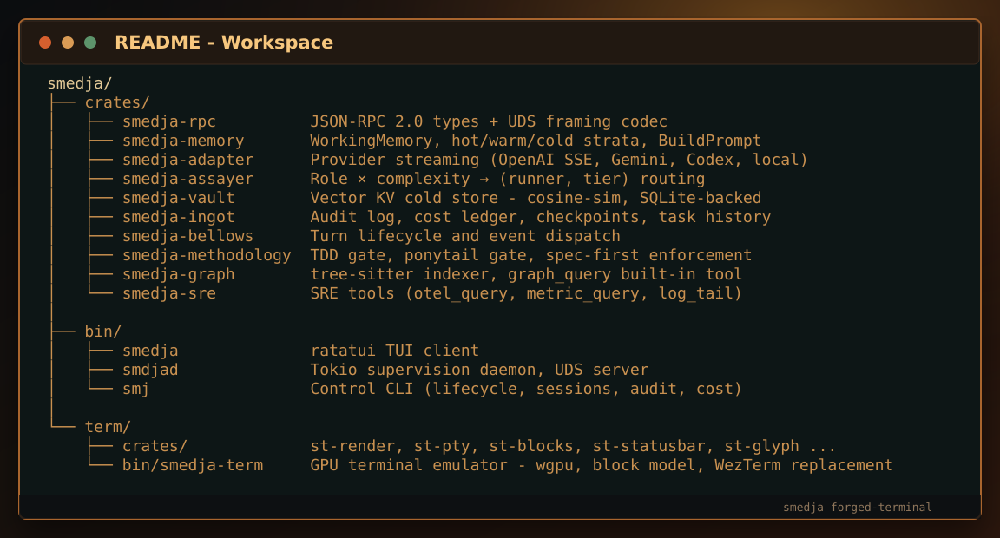
</div>

The kitchen/restaurant theme from milliways is retired. Metalworking instead:

| milliways (Go)  | smedja (Rust)      | What it does                       |
|-----------------|--------------------|------------------------------------|
| sommelier       | smedja-assayer     | tests and routes by quality        |
| kitchen/adapter | smedja-adapter     | shapes output to provider spec     |
| pantry          | crucible (in-mem)  | material held under heat           |
| mempalace       | smedja-vault       | cold durable storage               |
| pipeline        | smedja-bellows     | drives throughput                  |
| ledger/history  | smedja-ingot       | the produced unit, audit record    |

---

## Multi-Agent Architecture

`smdjad` runs multiple agent roles in parallel, each isolated in its own git worktree, coordinated by an orchestrator that understands role dependencies.

<div align="center">
  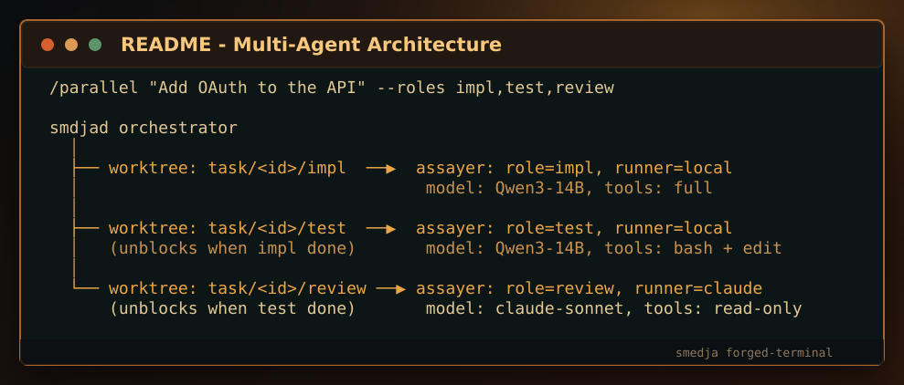
</div>

Roles and their defaults live in `.smedja/agents.toml` — committed to the repo, portable across machines, not tied to any specific harness:

```toml
[roles.impl]
runner = "local"
model  = "Qwen3-14B"
tools  = ["read_file", "edit_file", "bash", "graph_query"]

[roles.review]
runner = "claude"
tier   = "deep"
tools  = ["read_file", "graph_query"]  # review is intentionally read-only

[roles.sre]
runner = "claude"
tier   = "deep"
tools  = ["read_file", "otel_query", "metric_query", "log_tail"]
```

The assayer routes by **role + complexity**, not just complexity. A simple fix stays local; an architecture review goes to claude deep. No manual model selection per task.

---

## Loop Pipeline

`smj loop run` takes one OpenSpec task at a time through planning, red/green implementation, deterministic verification, read-only review, and bounded fix retries.

<div align="center">
  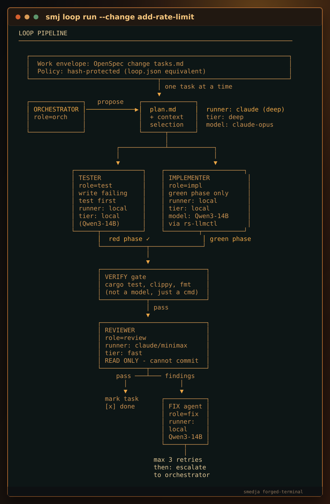
</div>

The loop router keeps planning on the strongest tier while pushing mechanical red/green/fix work to local runners.

<div align="center">
  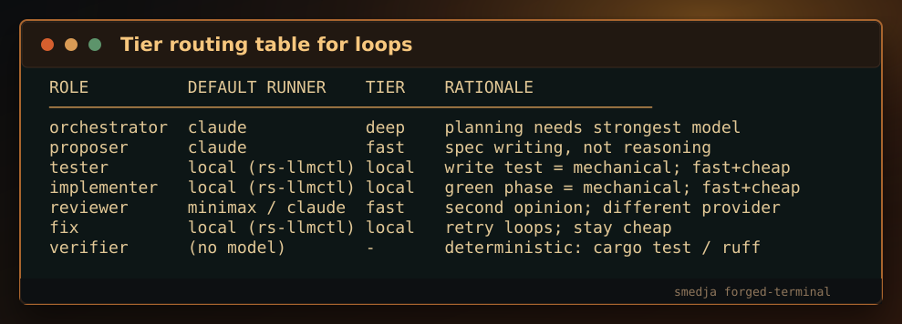
</div>

The new `smedja-loop` concept binds `.smedja/loop.json` to OpenSpec task state, mines failures into role guides, and keeps evaluators separate from generators through runner configuration.

<div align="center">
  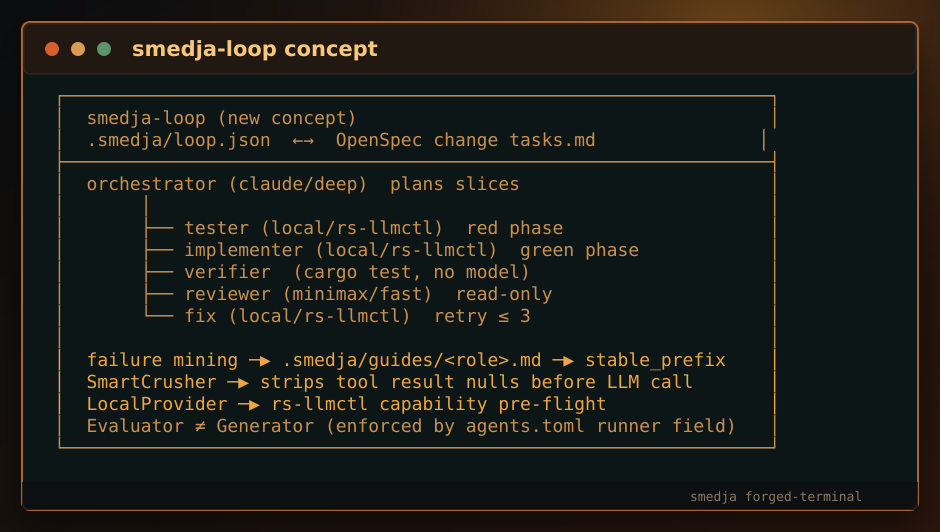
</div>

### Workspace layout

`loop.run` consumes a workspace laid out under `.smedja/` plus the OpenSpec change envelope:

```
<workspace>/
├── .smedja/
│   ├── loop.json          # loop engine policy (see below) — required by loop.run
│   ├── agents.toml        # per-role runner/tier/model routing overrides
│   ├── workspace.toml     # optional workspace-level settings
│   └── guides/<role>.md   # failure guides, written by the engine on failure
└── openspec/
    └── changes/<name>/
        └── tasks.md       # the work envelope; pending `- [ ] ` lines become slices
```

The change name passed to `loop.create` selects `openspec/changes/<name>/tasks.md`; each unchecked `- [ ] ` line is one slice the pipeline drives.

### `loop.json` policy

`.smedja/loop.json` is the policy contract. Its SHA-256 is hashed at load; if the file changes mid-run the loop aborts in the terminal `policy_tampered` state. The reviewer and implementer **must** use different runners (evaluator/generator separation) or the loop fails closed before any role runs.

```json
{
  "version": 1,
  "limits": { "max_attempts": 3, "agent_timeout_s": 600 },
  "roles": [
    { "name": "implementer", "runner": "local",   "tier": "local", "read_only": false, "tools": [] },
    { "name": "reviewer",    "runner": "minimax",  "tier": "fast",  "read_only": true,  "tools": [] },
    { "name": "fix",         "runner": "local",    "tier": "local", "read_only": false, "tools": [] }
  ],
  "verification": { "command": ".smedja/bin/verify.sh" },
  "review":       { "per_slice": true, "required": true },
  "publication":  { "max_pr_lines": 400 }
}
```

| Field | Meaning |
|-------|---------|
| `limits.max_attempts` | Maximum role attempts per slice before the loop fails. |
| `limits.agent_timeout_s` | Per-role wall-clock timeout. |
| `roles[]` | Each role's `runner`, `tier`, optional `model`, `read_only`, and allowed `tools`. |
| `verification.command` | Deterministic gate run after each slice; exit code 0 = pass. |
| `review.per_slice` / `required` | Whether the reviewer runs each slice and whether a failing review blocks progress. |
| `publication.max_pr_lines` | Maximum changed lines permitted per published slice. |

The verification gate's wall-clock budget defaults to 300 seconds; override it with the `SMEDJA_LOOP_VERIFY_TIMEOUT` environment variable (seconds). A loop with no `.smedja/loop.json` fails fast rather than running.

---

## Session Memory and Sharing Between Agents

Every session runs through three memory strata. Context budget is allocated per runner tier — a `fast` runner gets hot + top-K warm; a `deep` runner gets everything.

<div align="center">
  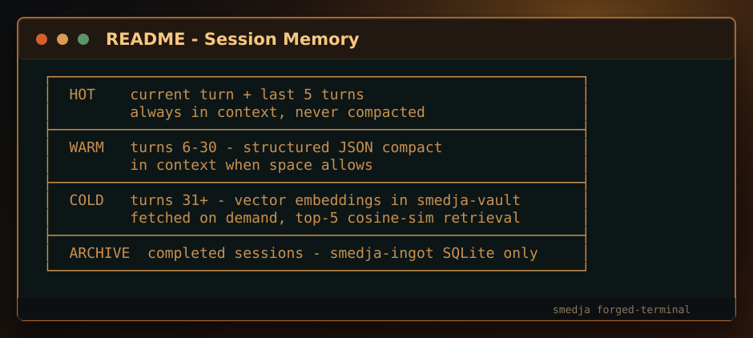
</div>

Compaction produces structured JSON, not a free-text summary. Each compacted turn becomes a structured object that can be expanded and replayed — `smj session rollback <id> <turn>` reconstructs any point in history. (**Note:** `smj session rollback` is on the roadmap; the underlying compaction format is in place.)

### How Parallel Agents Share Memory

When tasks fan out to parallel worktrees, agents share **read** access to `smedja-vault` (cold store) but write to isolated working trees. The orchestrator merges vault writes on task completion. (**Note:** `smedja-vault` storage and cosine-similarity retrieval are implemented; the `smedja_vault_search` tool exposed to agents currently returns empty results — daemon wiring is in progress.)

<div align="center">
  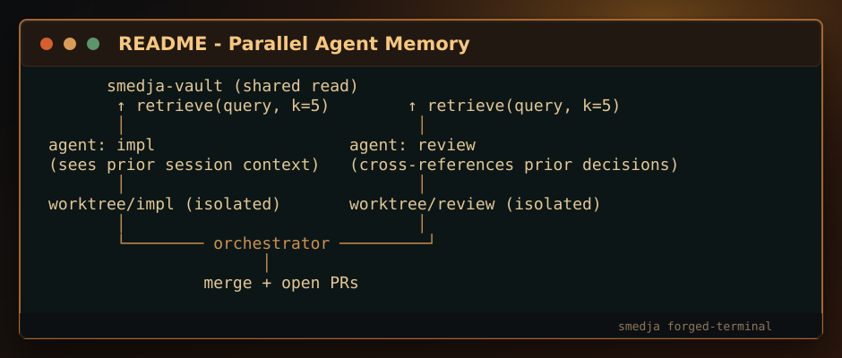
</div>

Both agents pull from the same cold memory — they know what was decided in previous sessions — but neither one touches the other's working tree.

---

## Context Budget Control

**SmartCrusher** (`smedja-adapter`) strips JSON nulls, zero-value arrays, and repeated keys from tool results before serialisation. Tool-heavy sessions see 30–60% token reduction on tool_result content alone. Implemented and tested.

**Stable-prefix / CacheAligner** (`smedja-memory`) tracks a `stable_prefix` boundary in the working window. The foundation is wired — `seal_prefix()` marks turns below the compaction line so they are never reordered or discarded. The adapter-side `BuildPrompt` integration that freezes provider cache hints is on the roadmap.

**Verbosity steering** (`smedja-memory`) appends a `<conciseness>` directive to the system prompt when context exceeds 60% of the window. Implemented and tested.

---

## The Terminal Experience

### Turn Blocks

Agent output is structured, not a flat scroll. Each turn is a discrete `TurnBlock`:

<div align="center">
  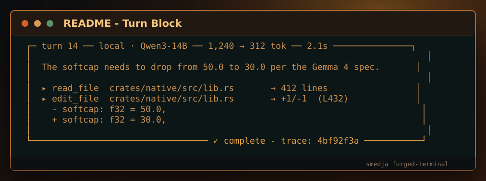
</div>

Blocks are selectable (`↑↓`), copyable (`c`), replayable (`r`). The `trace:` in the footer is a W3C `traceparent` — open it in your OTel backend to see the full span tree for that turn.

### Modular Status Bar

Modules evaluated in parallel (rayon) on every render tick, < 50ms target:

<div align="center">
  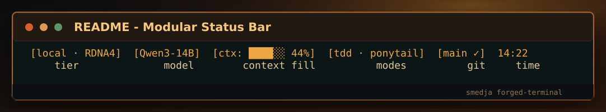
</div>

TOML-configured, Starship-compatible module format. The milliways-specific modules (`tier`, `model`, `context_pct`, `milliways_task`) sit alongside the standard set with the same detection + format + style fields — existing Starship config is portable.

### Cowork Gate

In cowork mode, every tool call pauses for approval — not just Codex, every runner. The daemon-side gate (`cowork.set` / `cowork.approve` / `cowork.deny` / `cowork.modify` RPC methods) is fully implemented and tested.

<div align="center">
  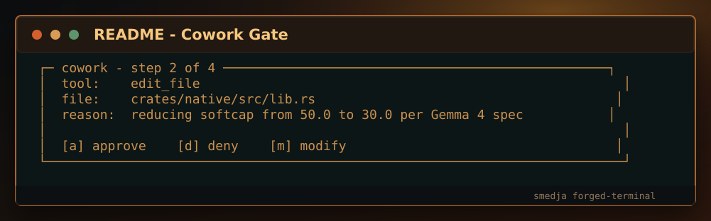
</div>

Deny sends the reason back as a tool error — the agent re-plans from there. Modify replaces the arguments before execution. Every decision is recorded in `smedja-ingot` as an audit event with `tool_name`, `decision`, and `agent_reasoning`.

**Current state:** Enable cowork mode from `smedja-tui` with `/cowork on`. Approval prompts appear as text lines in the agent block. An interactive inline approval widget (keyboard `y`/`n`/`m` shortcuts) is on the roadmap.

### Context Rail

`Ctrl-R` opens a right panel showing context slot fill live:

<div align="center">
  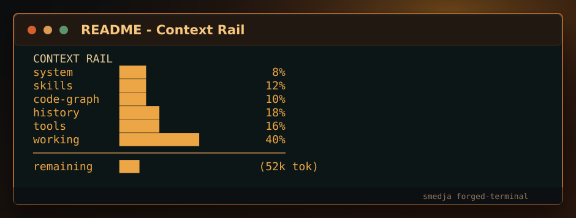
</div>

Green < 60%, yellow 60–80%, red > 80%. The slot breakdown matches the `stablePrefix` model — you see exactly what's locked in the KV cache prefix and what's competing for the remaining budget.

---

## Observability

Every span follows `gen_ai.*` semantic conventions. Every outbound HTTP request — provider API calls, MCP server requests, ACP callbacks — carries a W3C `traceparent`. You can follow a user message from the TUI keystroke through model inference and back to the audit log in a single trace.

<div align="center">
  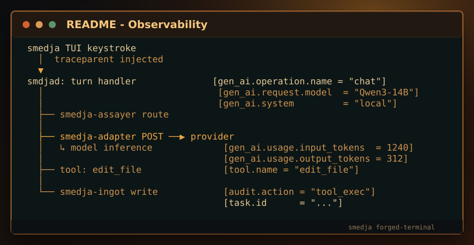
</div>

`smj session cost` reads `smedja-ingot` and prints a per-session cost breakdown by model and runner. `prices.toml` ships bundled — no external API call required.

---

## Spec-First Methodology

`smedja-methodology` enforces a workflow before the agent can touch files. The gate is a compile-time `Mode` enum — not a runtime plugin, not optional in CI.

<div align="center">
  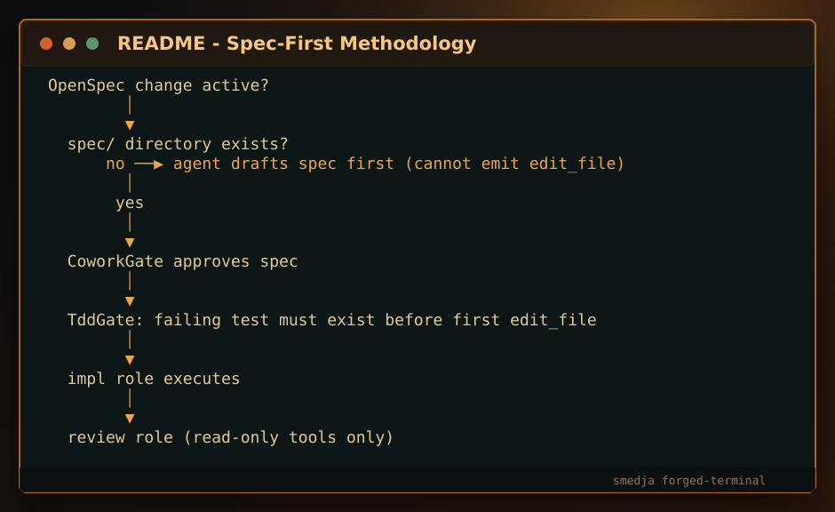
</div>

`--no-spec-gate` disables it per session for quick patches. In normal operation the sequence is: spec → approval → test → implementation → review.

---

## smedja

A GPU-accelerated terminal emulator. wgpu on Metal / Vulkan / DX12, `cosmic-text` for font shaping, `taffy` flexbox for split panes.

The difference from WezTerm: `smedja` knows what a smdjad session is. Agent turns render as `AgentBlock` widgets — tier badge, token count, traceparent, inline cowork gate — not raw byte streams. Shell commands render as standard `Block` units (Warp-style): selectable, copyable, independently scrollable.

**Current state:** Text renders using system fonts via `cosmic-text`. Startup is non-blocking — `FontSystem` initialises with an empty database (< 5 ms) and loads system fonts lazily on first glyph rasterisation. Individual glyph atlas misses are logged as warnings but do not crash the renderer. Background image blit is not yet implemented. The TUI approval widget for cowork gate is on the roadmap; approval events currently display as text lines in the agent block.

Custom glyphs (tier badges, status icons, block decorations) register via the **Glyph Protocol** — APC sequences that map vector shapes to Unicode PUA codepoints. No Nerd Font patches required. (Roadmap — the protocol is specified; PUA glyph registration is not yet wired.)

<div align="center">
  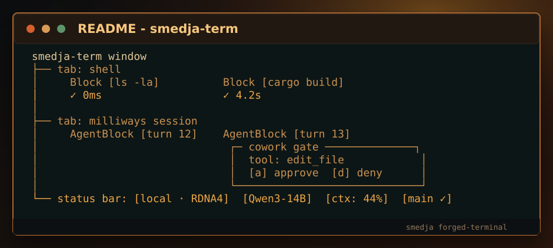
</div>

Config is TOML. A migration tool converts existing WezTerm Lua config.

`smedja-tui` is a ratatui agent dashboard that runs as a normal app inside smedja (or any terminal). Launch it with `smedja-tui` from the shell.

---

## Install

### macOS

**One-line install (recommended)**

```sh
curl -fsSL https://github.com/mwigge/smedja/releases/latest/download/install.sh | sh
```

Installs `smdjad`, `smj`, `smedja`, and `smedja-tui` to `~/.local/bin/` and registers `smdjad` as a LaunchAgent so it starts at login.

**DMG**

Download `smedja-darwin-<arch>.dmg` from the [latest release](https://github.com/mwigge/smedja/releases/latest), open it, and drag `smedja.app` to `/Applications`.

**Gatekeeper**

macOS will block unsigned binaries downloaded from the internet. Run once after install to clear the quarantine flag:

```sh
# For the install.sh tarball install:
xattr -dr com.apple.quarantine ~/.local/bin/smedja ~/.local/bin/smdjad ~/.local/bin/smj ~/.local/bin/smedja-tui

# For the .app bundle:
xattr -cr /Applications/smedja.app
```

Alternatively: right-click the binary or app in Finder → Open → Open anyway.

---

### Arch Linux / CachyOS

Install from the AUR using any AUR helper:

```sh
yay -S smedja
# or: paru -S smedja
```

Or build from the PKGBUILD directly:

```sh
git clone https://github.com/mwigge/smedja
cd smedja/assets
makepkg -si
```

After install, enable the daemon for auto-start on login:

```sh
systemctl --user enable --now smdjad
```

---

### Debian / Ubuntu

Download the `.deb` from the [latest release](https://github.com/mwigge/smedja/releases/latest):

```sh
curl -fsSL -O https://github.com/mwigge/smedja/releases/latest/download/smedja-linux-x86_64.deb
sudo dpkg -i smedja-linux-x86_64.deb
```

Enable the daemon:

```sh
systemctl --user enable --now smdjad
```

---

### Fedora

Download the `.rpm` from the [latest release](https://github.com/mwigge/smedja/releases/latest):

```sh
sudo dnf install https://github.com/mwigge/smedja/releases/latest/download/smedja-linux-x86_64.rpm
```

Enable the daemon:

```sh
systemctl --user enable --now smdjad
```

---

### WSL2

Install the Linux tarball as normal — smedja renders via WSLg. Ensure WSLg is enabled in your Windows setup (Windows 11 or Windows 10 with WSLg preview).

```sh
curl -fsSL https://github.com/mwigge/smedja/releases/latest/download/install.sh | sh
```

If systemd is not available in your WSL2 distro, add this to `~/.bashrc` or `~/.zshrc` to start the daemon automatically:

```sh
pgrep -u "$USER" smdjad >/dev/null || smdjad &
```

---

### Build from source

Requires Rust stable ≥ 1.82.

```bash
git clone https://github.com/mwigge/smedja
cd smedja
cargo build --release --workspace
cp target/release/{smdjad,smj,smedja-tui,smedja} ~/.local/bin/
```

## Getting Started

```bash
# 1. start the daemon (socket auto-placed at $XDG_RUNTIME_DIR/smdjad.sock)
smdjad

# 2a. open the agent dashboard TUI inside any terminal
smedja-tui
# optional flags: --mode impl|review|test|sre  --tier fast|deep  --sock /path/to/smdjad.sock

# 2b. or open the GPU terminal (launches smedja-tui as its default app)
smedja

# 3. send a message — type in the TUI input bar and press Enter
#    the daemon routes the turn to the configured provider and streams the reply

# control CLI
smj session list
smj session cost
smj workspace agents
```

The daemon reads `$XDG_RUNTIME_DIR/smdjad.sock` (falls back to `/tmp/smdjad.sock`). The TUI and `smj` CLI use the same default; override with `--sock` or `SMEDJA_SOCK`.

---

## License

Apache 2.0 — see [LICENSE](LICENSE).
